## Taxi Demand Predictor Service 🚕

- This repo is aimed at making it **easy to start playing and learning** about **MLOps**. 

- My interest in creating this project was ignited after reading UBER's blog post on (:link: [Demand and ETR Forecasting at Airports](https://www.uber.com/en-GB/blog/demand-and-etr-forecasting-at-airports/))

## Table of Contents 📑
  * [Quick Setup](#quick-setup)
  * [Problem Statement](#problem-statement)
  * [Data Processing](#data-processing)
  * [Model Training](#model-training)
  * [MLOps](#mlops)
  * [Live Demo](#live-demo)


## Quick Setup

1. Install [Python Poetry](https://python-poetry.org/)
    ```
    curl -sSL https://install.python-poetry.org | python3 -
    ```

2. cd into the project folder and run
    ```
    $ poetry install
    ```

3. Activate the virtual env that you just created with
    ```
    $ poetry shell
    ```

## Problem Statement

- You work as a data scientist 👨‍🔬👩‍🔬 in a ride-sharing app company 🚗 (e.g. Uber)

- Your job is to help the operations team **keep the fleet as busy as possible**.

### Supply 🚕 and demand 👨‍💼

<p align="left">
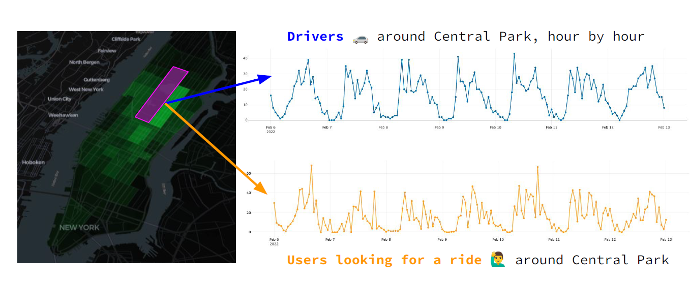
</p>

<p align="left">
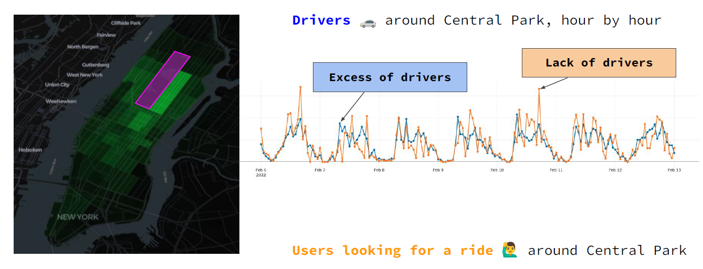
</p>

<p align="left">
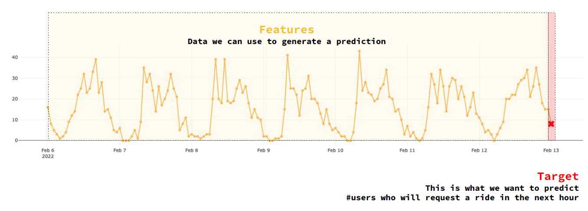
</p>


## Data Processing

**Step 1 - Data Validation** ✔️ ❎

<p align="left">
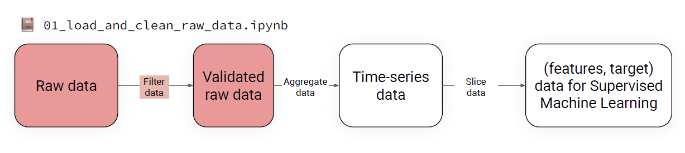
</p>


**Step 2 - Raw data into time-series data**

<p align="left">
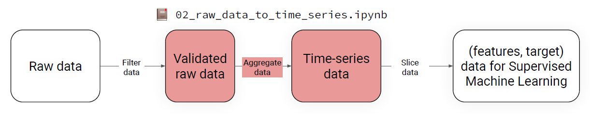
</p>


**Step 3 - Time-series data into (features, target) data**

<p align="left">

</p>

**Step 4 - From raw data to training data**

<p align="left">

</p>

**Step 5 - Explore and visualize the final dataset**

<p align="left">
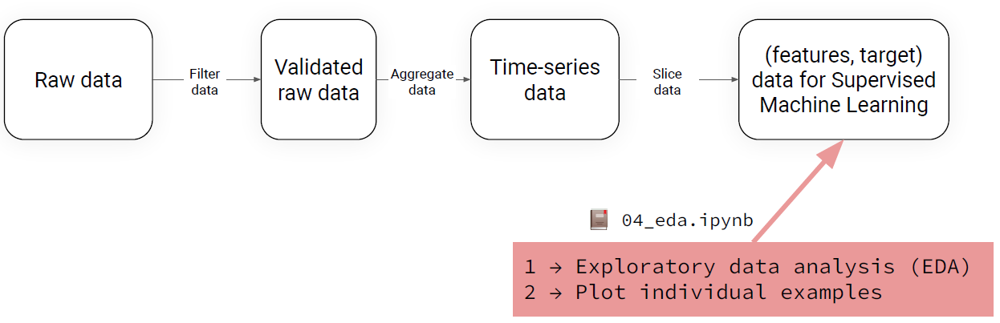
</p>


## Model training

<p align="left">
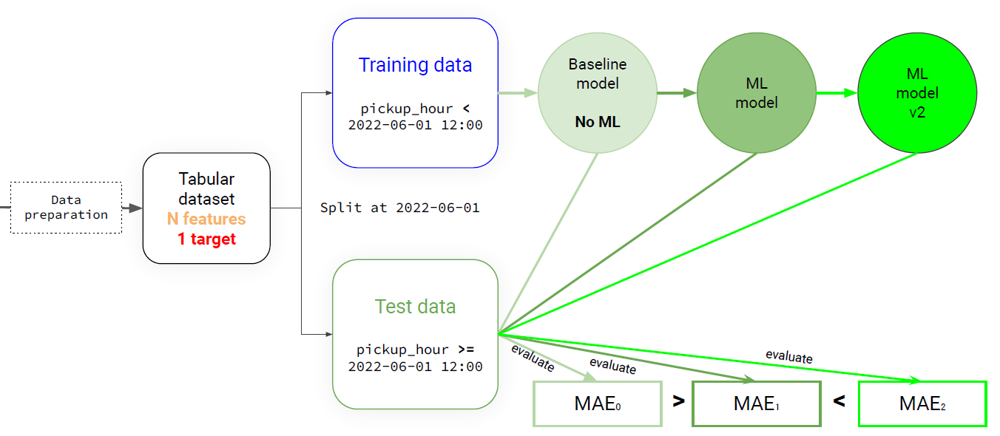
</p>

## MLOps

### Batch-scoring system 🤹

**Step 1 - Prepare data**

<p align="left">
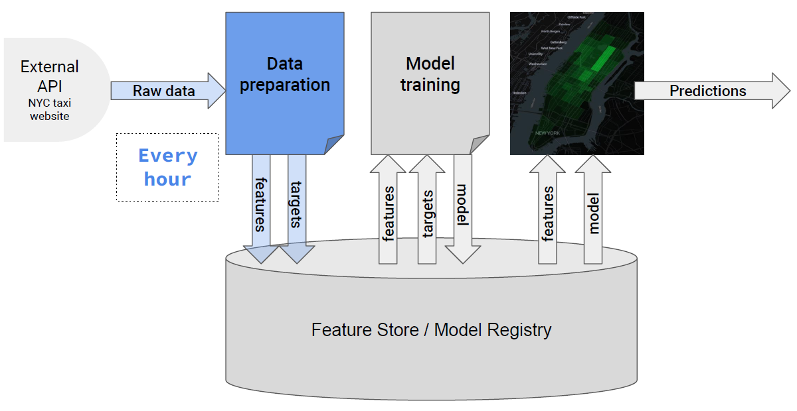
</p>

**Step 2 - Train ML Model**

<p align="left">
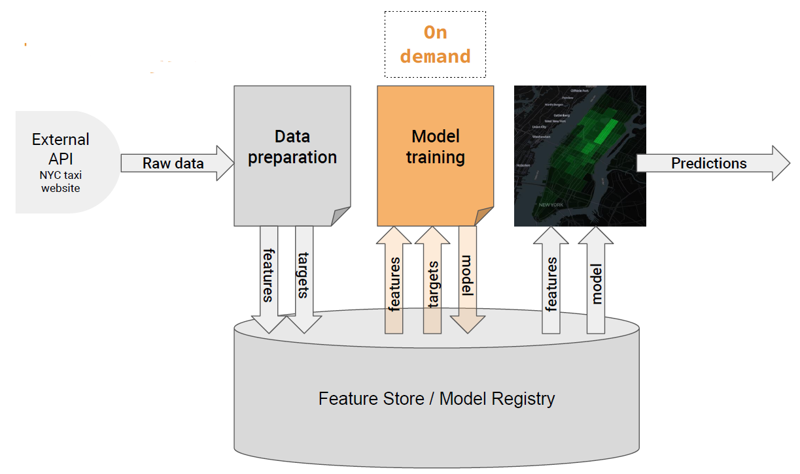
</p>

**Step 3 - Generate predictions on recent data**

<p align="left">
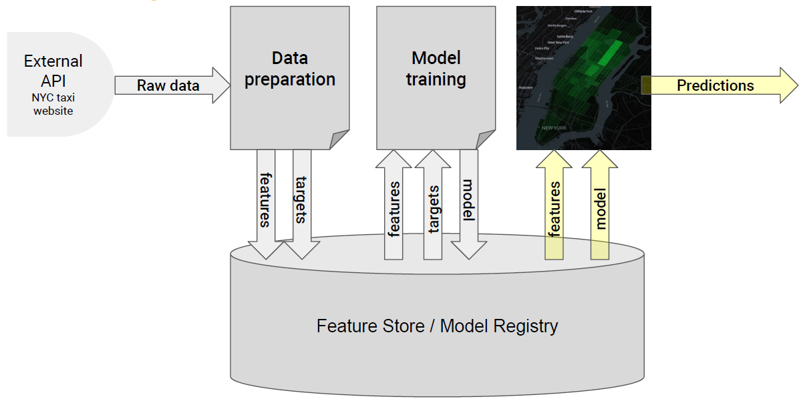
</p>


**Serverless MLOps tools**

- **Hopsworks** as our feature store

- **Github ACtions** to schedule and run jobs


**Feature Store**

<p align="left">
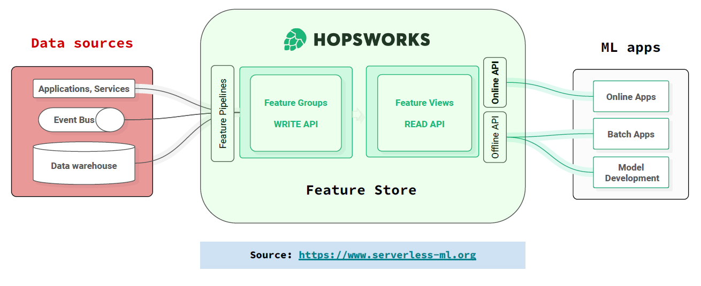
</p>


## Live Demo
 - work in progress
